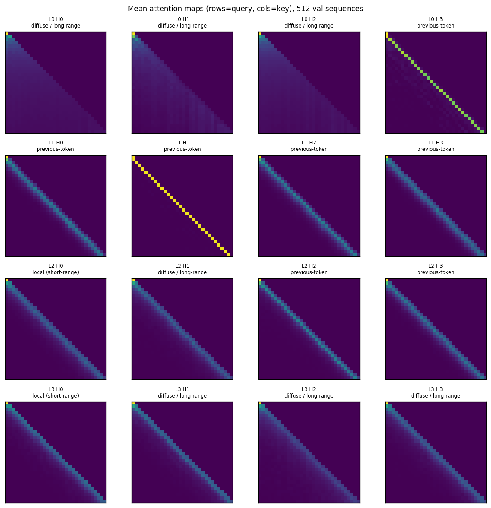
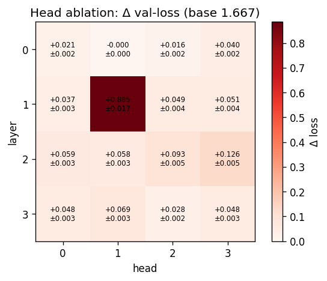
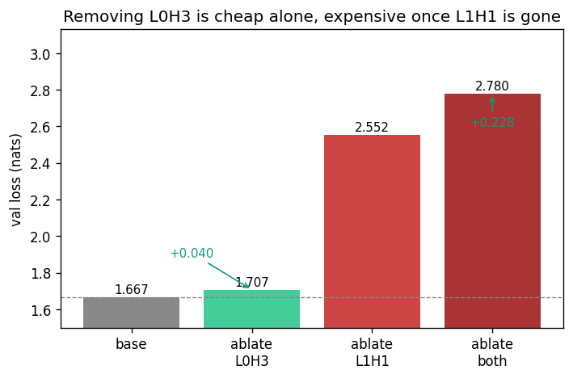
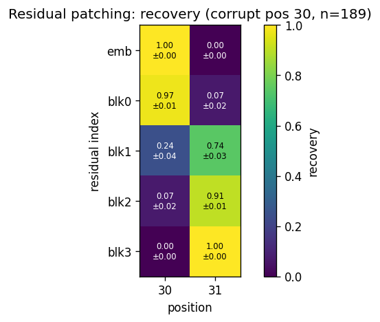
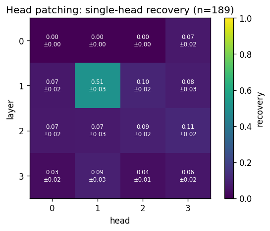
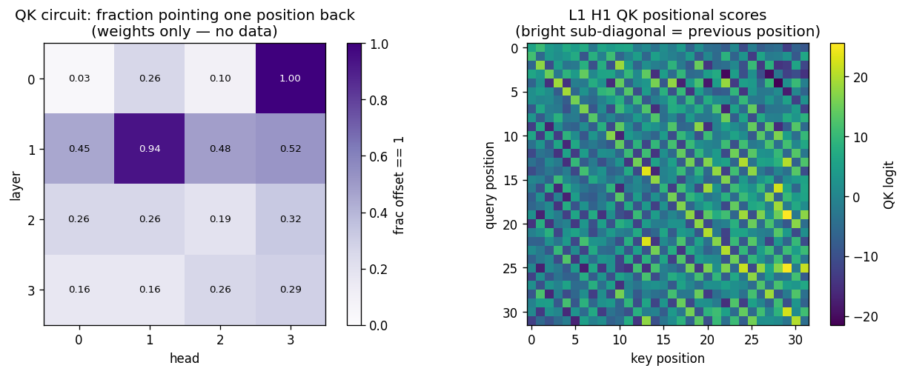
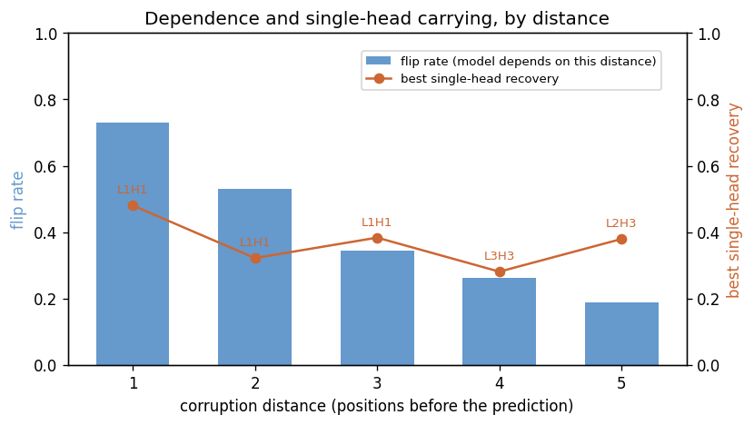

# gpt


A modular, instrumented rebuild of Karpathy's *"Let's build GPT"* capstone, taken
apart to see how the trained model actually works.

The short version of what I found: in this 4-layer, 4-head character model, almost
all of the predictive work runs through a single attention head — layer 1, head 1 —
which fetches the previous character into the position that predicts the next one.
Two heads *look* like they do that job — and their weights say they compute the same
thing — but only one of them actually matters, and it took intervening on the network
to tell them apart. Retrain from a different seed and the same kind of head takes
over, just not always at the same index.

This is the third in a series after
[micrograd](https://github.com/diego-magana/micrograd) (a scalar autograd engine)
and [makemore](https://github.com/diego-magana/makemore) (n-gram to WaveNet
character models). makemore ends by showing that a gradient-based context measure
comes back flat while a causal ablation shows the model leaning hard on the most
recent character — the same recency, found the same way, one architecture down. The
transformer-circuit methods here are what I pointed forward to at the end of it.

---

## What I found

I trained the full model to convergence and ran eight analyses on it — two that just
look at the network (attention patterns, the residual stream), five that intervene on
it (head ablation, a pairwise-ablation redundancy test, residual patching, head
patching, and a corruption-distance sweep), and one that reads the weights directly
(the QK/OV circuits). The interesting part is
that looking and intervening disagree, and the disagreement is where the real result
is.

**The model has two heads that look like previous-token heads.** Averaging attention
over 512 held-out sequences, layer 0 is mostly diffuse, layer 1 leans entirely on
the preceding token, and layers 2–3 do shorter-range, more self-weighted mixing. Two
heads stand out as sharp previous-token heads: L1 H1, which puts ≈ 0.98 of its
attention on the preceding token with almost no entropy, and L0 H3 at ≈ 0.82. On the
attention maps they read as the same kind of head.



**Only one of them matters.** When I zero each head and remeasure validation loss,
L1 H1 costs ≈ 0.89 ± 0.02 nats — seven times more than any other head and far
outside the error bar. L0 H3, the *other* sharp previous-token head, costs
≈ 0.04 ± 0.00. Nearly identical attention patterns, an order of magnitude apart in
how much the model actually needs them. This is the part I'd point a reviewer at
first: the attention maps alone would have told me these two heads were
interchangeable, and they aren't close.



**The reason L0 H3 is free is redundancy — and I tested it instead of asserting it.**
If L0 H3 is cheap to remove only because L1 H1 carries a stronger copy of the same
signal downstream, then it should get expensive once L1 H1 is gone. It does: ablating
L0 H3 on its own costs ≈ 0.04, but ablating it once L1 H1 is *already* ablated costs
≈ 0.23 — almost six times as much. L0 H3 isn't dead weight; it's a backup
previous-token head whose contribution is masked by the stronger one.



**Residual patching shows where the information flows.** I take a clean context,
corrupt the character two positions before the end, and patch the clean
residual-stream activations back in one site at a time, measuring how much of the
original prediction comes back (as a contrastive logit difference, on the 189 of 256
examples where the corruption actually flipped the prediction). Through the embedding
and block 0 the corrupted information sits at its own position. Then block 1 moves it
forward: recovery jumps from ≈ 0.24 at the corrupted position to ≈ 0.74 at the
prediction position, and the later blocks carry it the rest of the way.



**Head patching pins it on L1 H1 directly.** Residual patching localizes the move to
block 1, but block 1 has four heads and an FFN — it can't tell me *which* head does
the copying. So I patch one level down: splice a single head's clean output into the
corrupted run and leave everything else corrupted. Restoring L1 H1 alone recovers
≈ 0.51 ± 0.03 of the prediction — five times the next head. One head out of sixteen
accounts for roughly half the effect by itself. It isn't all of it, and it shouldn't
be, since the previous-token signal also leaks through other paths; but I'm no longer
inferring L1 H1 from "block 1 matters" plus "L1 H1 ablates hardest," I'm routing its
clean output into a broken run and watching the prediction come back.



**The weights say the same thing — and correct my language.** Everything above reads
the network's behavior on data. The weights are stricter evidence, because a pattern
in the parameters can't be a corpus artifact. L1 H1's **QK circuit**, computed from
the position embeddings alone with no data and no forward pass, points exactly one
position back for **94%** of query positions — so "previous-token head" is what the
learned weights compute, not just how the head behaves on Shakespeare. L0 H3 scores
**1.00**: an even purer previous-token circuit than the head doing all the work. That
is the redundancy result arriving from a completely independent direction — the two
heads implement the *same* positional map, which is precisely why the model can lean
on one and leave the other nearly free. Nothing else clears 0.52.

The **OV circuit** is where I had to correct myself. A true copier would push logit
*x* up when it attends to token *x*; the OV matrix has no such diagonal (top-1
agreement ≈ 0.02). But it doesn't destroy the information either — the map is full
head-rank and sends the 65 tokens to well-separated vectors. So the head *preserves
which token it attended to and writes it into a learned subspace*, not into the
unembedding direction. L1 H1 is a previous-token **mover**, not a direct-path copier
— which is exactly why patching it alone recovers 0.51 and not 1.0: layers 2–3 have
to decode what it wrote. The head fetches the character; the rest of the network
turns it into a prediction.



**How far back does the mechanism reach?** Everything above corrupts the token one
position back, which probes the previous-token path by construction — so I swept the
corruption distance to check the boundary. The model's dependence falls steadily with
distance (the flip rate drops from ≈ 0.73 one position back to ≈ 0.19 five positions
back — it leans hardest on the nearest token). And L1 H1 keeps carrying the signal
past distance 1, staying the top head at distances 2–3: not because it reads two
positions back, but because previous-token copies *compose* — the token one-back
already encodes the token two-back, and L1 H1 copies that forward. There's no
dedicated long-range head; by distances 4–5 the carrier shifts and the estimate goes
noisy as few predictions still depend on it.



**The prediction sharpens steadily with depth.** Reading each layer's residual stream
through the final unembedding (the logit lens), top-1 next-character accuracy climbs
0.06 → 0.12 → 0.21 → 0.34 → 0.51 across the four blocks, with the last block doing
the most. The logit lens is a lower bound, not a decoder: it reads intermediate
streams through the *final* unembedding, so it under-reads any feature a layer has
computed but not yet rotated into the output basis. The embedding-level readout
already lands at 6%, a weak unigram prior baked into the static embeddings before any
attention runs.

**Is "L1 H1" an accident of initialization?** Partly. I retrained the same
architecture from four more seeds (at a reduced 3k-step budget — the specialization
is unambiguous well before convergence) and recorded, for each, the single most
causally important head. Across all five seeds it is *always* a sharp previous-token
head (prev 0.90–0.97) sitting in layer 0 or 1 — but which head it lands in moves
around (L1 H1 here, L0 H0 / L0 H1 / L0 H3 elsewhere). So the mechanism replicates and
the head index doesn't. "L1 H1 carries the prediction" is true of *this* model; the
durable statement is "training reliably builds a previous-token head, and the model
leans on it."

What this doesn't show, and the two things I'd want before calling it a circuit
(path patching to decompose the downstream path the OV circuit implies, and anything
non-local — `block_size=32` and 0.21M parameters leave no room for induction heads, so
this is the one mechanism a tiny local model *can* have) are spelled out at the end of
[`notebooks/05_attention_analysis.ipynb`](notebooks/05_attention_analysis.ipynb).

---

## What it builds

The analyses run on a model I build up one ingredient at a time in
[`notebooks/progression/`](notebooks/progression). To keep the comparison about the
*architecture* rather than about training length, I hold the three transformer
stages at a fixed 5,000-step budget:

| Stage | Params | Steps | Val loss (nats) |
|-------|-------:|------:|----------------:|
| Bigram baseline | 4,225 | 20,000 ¹ | 2.474 |
| + single attention head | 22,721 | 5,000 | 2.356 |
| + multi-head + feed-forward | 59,969 | 5,000 | 1.985 |
| **Full GPT** (4 blocks, residual + LayerNorm) | 209,729 | 5,000 | **1.798** |

The checkpoint I actually analyze is that same full architecture trained to
convergence — 30,000 steps, val ≈ 1.65 — because the analysis is more honest on a
model that's near its ceiling than on one still mid-descent. The 5k row above is the
controlled comparison point;
[`notebooks/progression/04_full_gpt.ipynb`](notebooks/progression/04_full_gpt.ipynb)
shows both.

¹ The bigram is a different kind of model with a fixed first-order floor, so I train
it to convergence (it plateaus by ~16k steps) instead of to the transformers' shared
budget. Every run uses seed 1337, batch size 16, learning rate 1e-3, AdamW, and
isolated fixed-seed evaluation; val loss is mean cross-entropy over held-out Tiny
Shakespeare. The committed 30k checkpoint reproduces a single-character-model
reference run to within ≈ 0.01 nats.

---

## Run it

```bash
pip install -e .                       # editable install; pulls torch, numpy, matplotlib
python train_gpt.py                    # reproduce assets/gpt.pth (~15 min on CPU, 30k steps)
python seed_sweep.py --seed 0          # reproduce one row of the seed-robustness check
jupyter lab notebooks/                 # run the progression, then 05_attention_analysis
```

The tests cover the package's correctness invariants — including the two the patching
analyses rest on, that splicing a run's own clean activations (residual *or* a single
head's output) back in changes nothing:

```bash
pytest                                 # 18 tests, runnable from any directory
pytest -m "not slow"                   # 10 fast tests; skips the training-based ones
```

I commit `assets/gpt.pth` (the trained 30k model) so the analysis notebook runs on
its own without retraining. Every other `*.pth` is gitignored; that one is a
deliberate carve-out. Delete it and run `python train_gpt.py` to rebuild it from
scratch.

---

## Repository layout

```
gpt/
├── gpt/                      reusable package
│   ├── data.py              char tokenizer, train/val split, reproducible batching
│   ├── layers.py            Head, MultiHeadAttention, FeedForward, Block + ActivationCache
│   ├── train.py             training loop, isolated eval, generation, seeding
│   └── analysis.py          attention stats, ablation + redundancy, residual & head
│                            patching, QK/OV circuits, logit lens
├── models/
│   ├── bigram.py            the baseline
│   └── gpt.py               GPT + GPTConfig, instrumented forward, checkpointing
├── notebooks/
│   ├── 05_attention_analysis.ipynb     ← the analysis (start here)
│   └── progression/         01 bigram → 02 single head → 03 multihead+FFN → 04 full GPT
├── assets/                  gpt.pth, loss history, seed_robustness.json, figures
├── data/                    input.txt (Tiny Shakespeare)
├── tests/                   test_smoke.py (fast invariants), test_analysis.py (slow integration)
├── train_gpt.py             reproduce the 30k analysis checkpoint
└── seed_sweep.py            reproduce the seed-robustness check
```

---

## Implementation notes

A few places where the decision that mattered wasn't the obvious one:

- **I loop over a `ModuleList` instead of `nn.Sequential` for the blocks.** The
  source stacks them in `Sequential`. I loop explicitly so the forward pass can
  capture each layer's attention, residual stream, and per-head outputs, route
  head-ablation and head-patching to the right layer, and overwrite activations for
  patching. `Sequential` hides the loop and forbids exactly the per-layer access the
  whole analysis needs.
- **Two patching primitives, because they answer different questions.** Residual
  patching overwrites the residual *sum* at a (layer, position) — good for localizing
  *where* information is, blind to *which head* put it there. Head patching overwrites
  a single head's output, which is what isolates L1 H1 rather than just block 1. Both
  write out of place (a patch goes into a cloned tensor so a corrupted run can't
  clobber the cached clean activations), and both no-op invariants — splicing a run's
  own clean residual, or its own clean head output, back in — are unit tests. Without
  those invariants every recovery number is suspect, so I pinned them down rather than
  trusting them.
- **Patching uses a contrastive logit-difference metric and a flip-based selection.**
  Recovery is measured as the clean-vs-corrupt logit gap rather than one token's
  probability, which is less sensitive to overall distribution shifts, and I keep only
  the examples where the corruption actually flipped the top-1 prediction (189 of 256)
  — a selection I can state plainly instead of a hand-tuned threshold.
- **Every intervention reports an error bar.** Ablation deltas use the standard error
  of the *paired* per-batch difference (ablated minus intact on the same batch, which
  cancels the base-loss noise); patching recoveries report the standard error across
  examples. It's what lets me say the 7× ablation gap and the 5× head-patching gap are
  real and not sampling.
- **Evaluation draws from its own isolated RNG.** In the source, training and
  evaluation sample from the same global generator, so the trained weights quietly
  depend on how often you evaluate. I re-seed a separate generator inside
  `estimate_loss`, which decouples them — the loss curve is the same whether I
  evaluate every 250 steps or every 1000, and a chunked run, a single-shot run, and
  the notebooks all land on the same numbers.
- **Checkpoints describe themselves.** `GPT.save` stores the `GPTConfig` next to the
  weights and `from_pretrained` rebuilds the matching architecture. The most common
  way a checkpoint "loads but outputs garbage" is an architecture that drifted from
  the one that trained it; carrying the config closes that off.
- **Attention is scaled by `1/sqrt(head_size)`, not `1/sqrt(n_embd)`.** The variance
  of the query·key dot product grows with the *head* dimension, so that's what the
  scaling has to cancel. Get it wrong and nothing crashes — softmax just goes peaky
  at initialization and training stalls, which is the worst kind of bug.
- **The blocks are pre-norm.** LayerNorm sits inside each residual branch and leaves
  the skip path clean, so gradients reach the early layers — which is why notebook 03
  (multi-head + FFN with no residuals) is the harder model to optimize despite being
  shallower.

---

## Attribution

The architecture and training recipe follow Andrej Karpathy's *"Let's build GPT:
from scratch, in code, spelled out"* and
[nanoGPT](https://github.com/karpathy/nanoGPT); the corpus is Tiny Shakespeare. What
I added is the interpretability instrumentation (activation cache, head-ablation,
residual- and head-patching APIs, QK/OV weight-space circuits), the reproducibility
engineering (isolated evaluation, self-describing checkpoints, seeded interventions
with error bars), and the eight-part analysis this README leads with.
